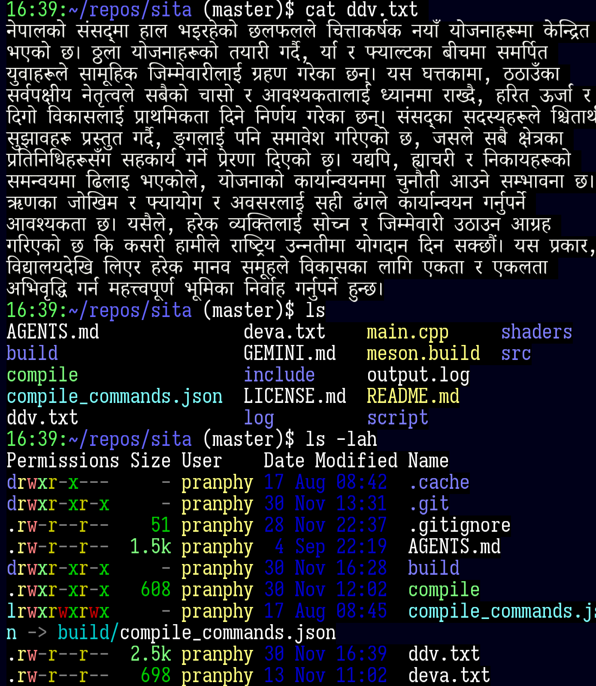

# SITA 
SImple Terminal Application

## Description
This is a terminal emulator written in C++.
This is a GPU-accelerated terminal application that hopes to render complex scripts like Devanagari nicely.
Demo


## Features
- Supports Indic fonts like Devanagari and has nice support for Indic languages.

## Installation
To install this project, follow these steps:
1. Install Meson and Ninja:
   ```bash
   sudo apt install meson ninja-build
   ```
2. Build the project:
   ```bash
   meson setup build
   cd build
   ninja
   ```


